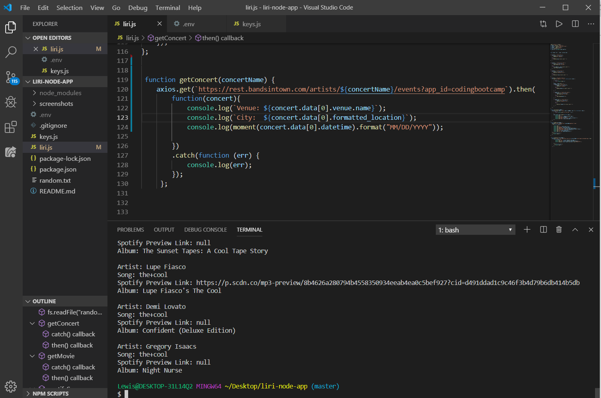
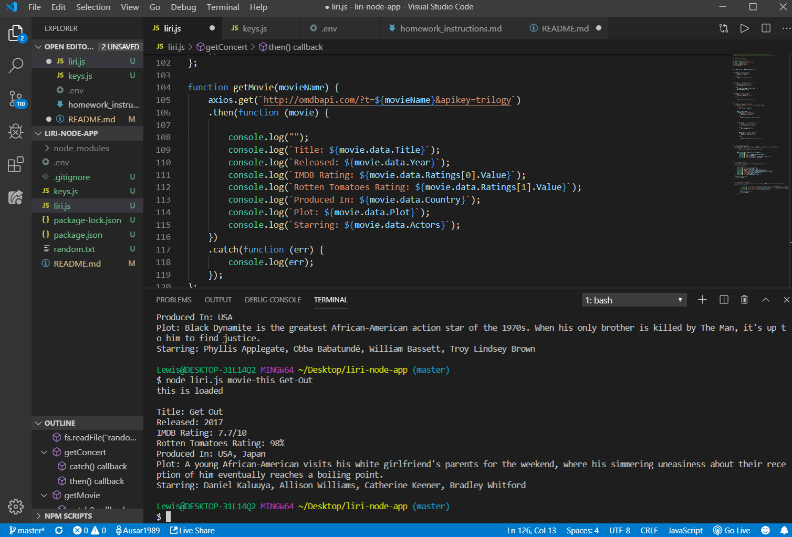
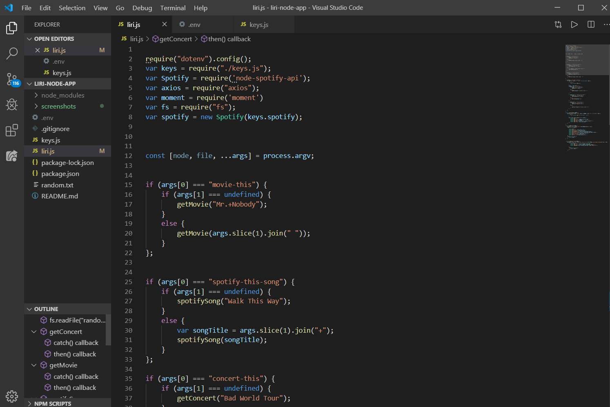

# liri_node_app
liri stands for language interpretation recognition interface.
This is a Node.js app that depends on user input from the command line
Integrate Axios, Spotify, and OMDb APIs via the appropriate NPM modules
Use API calls and parse through returned JSON objects, outputting them in a specified format
Read commands and queries from file.
# Code Explanation
Authentication keys for Spotify are stored in "keys.js", and we are exporting its contents to the main "liri.js" file
What our app does depends on what the user types, and there are 4 main functions:(1) Spotify lookup for a song, (2) OMDb lookup for a movie, and (3) read command and query from another file.
The program also makes a request to the Spotify API, and we get back a JSON object that includes everything we need (artist(s), song, preview link, and album)
The program also makes a HTTP request to the OMDb API using the request NPM module, and we get back a JSON object that includes everything we need (title, year, IMDb rating, language, etc.)
The program also reads from a file called "random.text" and executes the command and query found there using string and array methods
Appropriate comments and error-checking has been added. The concert function still needs work and the Spotify function is reading the client ID and the secret ID because the hastags were taken off the lines the IDs were on. they're no longer commented.

# Screenshots of The App

located in the screenshots directory.

# Screenshots
Response from the spotify server.

Response from OMDb server.

Snapshots of some of the code.

# Technologies Used
- Axios
- node.js
- Javascript
- Spotify API
- OMDb API

# Deployed Version

Installation (Deployed Version)
To run the application locally, first clone this repository with the following command.

git clone git@github.com:Ausar1989/liri-node-app.git
Next, install the application dependencies.

cd liri-homework
npm install
Finally, run the node server locally.

node liri.js `spotify-this-song "float on"`, `concert-this "john legend"`, `movie-this "Eternal Sunshine"`, `read-this-file`, `record-this`

Have a wonderful day!
